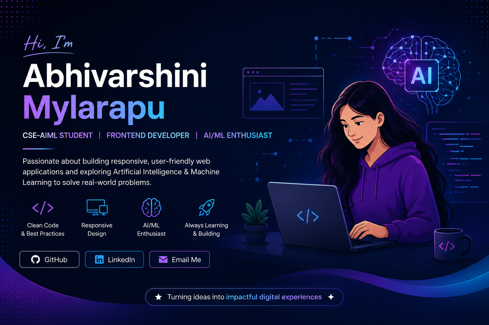

# 👩‍💻 Abhivarshini Mylarapu

### CSE-AIML Student | Frontend Developer | React.js | JavaScript | AI/ML Enthusiast | 2026

I enjoy building responsive, user-friendly web applications and exploring Artificial Intelligence and Machine Learning to solve real-world problems.

🌐 **[View My Portfolio](https://abhivarshinimylarapu-debug.github.io/abhivarshini-portfolio/)**

---

## 👩‍💻 About Me

I'm a BTech CSE-AIML student graduating in 2026 with an interest in software development, frontend development, and Artificial Intelligence & Machine Learning.

I enjoy building practical applications and turning ideas into functional digital experiences. I've worked on projects across web development and AI/ML, gaining hands-on experience by building and experimenting with different technologies.

I'm currently looking for opportunities where I can apply my technical knowledge, contribute to real-world projects, learn from experienced professionals, and continue growing as a developer.

---

## 🛠️ Tech Stack

### Programming
Python • Java (Basics)

### Web Development
HTML • CSS • JavaScript • React.js • Bootstrap

### Database
SQL

### AI / ML
Machine Learning • Deep Learning

### Tools
Git • GitHub

---

## 🚀 Featured Projects

### 📋 Task Manager

A responsive task management web application built with React.js and JavaScript.

🔐 **Demo Login**

**Email:** `sara@example.com`  
**Password:** `user123`

🌐 **[Live Demo](https://task-manager-8ppm9f9de-mylarapu-abhivarshini-s-projects.vercel.app)**

💻 **[Source Code](https://github.com/abhivarshinimylarapu-debug/Task---Manager)**

---

### 📊 Referral Dashboard

An interactive and responsive dashboard application for managing and viewing referral-related information.

🔐 **Demo Login**

**Email:** `admin@example.com`  
**Password:** `admin123`

🌐 **[Live Demo](https://referral-dashboard-e0o8ucvy6-mylarapu-abhivarshini-s-projects.vercel.app)**

💻 **[Source Code](https://github.com/abhivarshinimylarapu-debug/Referral-Dashboard)**

---

## 🧠 AI / ML Projects

### 🩺 AI-Driven Diagnosis of Oral Malignancies

**Academic Project**

- Developed a machine learning/deep learning model for early detection of oral malignancies.
- Applied image preprocessing and feature extraction techniques to improve prediction accuracy.
- Evaluated model performance using standard classification metrics.
- Designed the solution to assist healthcare professionals in early diagnosis.

### 💊 Fake Drug Detection System

**Academic Project**

- Developed a machine learning-based application to identify counterfeit medicines.
- Performed data preprocessing and model training for accurate drug classification.
- Built a user-friendly interface for efficient prediction and analysis.
- Focused on improving reliability and accessibility of medicine verification.

---

## 🎯 Looking For

I'm looking for opportunities as a **Frontend Developer, Software Developer, or AI/ML-focused role** where I can apply my knowledge, work on real-world projects, and continue learning and growing.

---

## 📫 Connect With Me

💼 **[LinkedIn](https://www.linkedin.com/in/abhi-varshini-248a56292)**

🐙 **[GitHub](https://github.com/abhivarshinimylarapu-debug)**

📧 **[Email](mailto:abhivarshinimylarapu@gmail.com)**

🌐 **[Portfolio](https://abhivarshinimylarapu-debug.github.io/abhivarshini-portfolio/)**

---

⭐ Thanks for visiting my profile!
